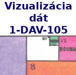

**[Pravidlá](./Rules.md) · [Práca v tíme](./Groups.md) · [Projekty](./Projects.md) · [Moodle](https://moodle.uniba.sk/course/view.php?id=3421) · [Google Classroom](https://classroom.google.com)**

Predbežný plán prednášok, môže sa ešte zmeniť podľa okolností.

* **Týždeň 1: 13.-19.2. Úvod do predmetu, systémy Jupyter a Colab, knižnica Matplotlib** Prednáška 1a [pdf](./pdf/L01a_visualization_history.pdf) **·** Prednáška 1b [notebook](https://colab.research.google.com/github/bbrejova/viz//blob/master/notebooks/L01b_Jupyter_Colab_Matplotlib.ipynb), [pdf](./pdf/L01b_Jupyter_Colab_Matplotlib.pdf) **·** [Cvičenie 1](./Tutorial1.md)

* **Týždeň 2: 20.-26.2. Spracovanie dát v knižnici Pandas** 
Prednáška 2 [notebook](https://colab.research.google.com/github/bbrejova/viz//blob/master/notebooks/L02_Processing_Pandas.ipynb), [pdf](./pdf/L02_Processing_Pandas.pdf) **·** [Cvičenie 2](./Tutorial2.md)

* **Týždeň 3: 27.2.-5.3. Základné typy grafov a ich vykresľovanie v knižniciach Matplotlib, Seaborn, Plotly** Prednáška 3a [pdf](./pdf/L03a_Plot_types.pdf)  **·**  Prednáška 3b [notebook](https://colab.research.google.com/github/bbrejova/viz/blob/master/notebooks/L03b_Plot_types.ipynb), [pdf](./pdf/L03b_Plot_types.pdf)

* **Týždeň 4: 6.-12.3. Základné popisné štatistiky a ich využitie vo vizualizácii** Prednáška 4 [notebook](https://colab.research.google.com/github/bbrejova/viz/blob/master/notebooks/L04_Summary_statistics.ipynb), [pdf](./pdf/L04_Summary_statistics.pdf)

* **Týždeň 5: 13.-19.3. Spracovanie dát v knižnici Pandas (2)** Prednáška 5 [notebook](https://colab.research.google.com/github/bbrejova/viz/blob/master/notebooks/L05_Pandas_2.ipynb), [pdf](./pdf/L05_Pandas_2.pdf) **·** [Projekty](./Projects.md)

* **Týždeň 6: 20.-26.3. Časové rady, siete, mapy** Prednáška 6 [notebook](https://drive.google.com/file/d/1ibX6BVoexO0sc-v8_RchdjYnhF0orpdM/view?usp=share_link)
<!--
| Prednáška 6 [https://youtu.be/S764DrJQ5FA video] {{Dot}} [https://drive.google.com/file/d/15HEM-cXNdvLv7g6_SalRg3scYBn-ZnS8/view?usp=sharing pdf] 
-->

* **Týždeň 7: 27.3.-2.4. Histogram, rozdelenie pravdepodobnosti, redukcia dimenzií**
<!--
| Prednáška 7 [https://youtu.be/rR1MAli-3XI video] {{Dot}} [https://drive.google.com/file/d/1YAXJBg9yBTtENcfk0onTNbPCv7W42JSy/view?usp=sharing pdf]
-->

* **Týždeň 8: 3.-9.4. Ľudské vizuálne vnímanie, farby, formáty**
<!--
| Prednášk 8 [https://youtu.be/d3GD7_MFCN4 video] {{Dot}} [https://drive.google.com/file/d/1hNDzXtHr4gbMH8xnrXOXZRF2pLY0Gk2X/view?usp=sharing  pdf]
-->

* **Týždeň 9: 10.-16.4. Preatentívne príznaky, gestalt a ilúzie**
<!--
| Prednáška 9 [https://youtu.be/N1DzdUK39wU video] {{Dot}} [https://drive.google.com/file/d/1T5wClkDjxQAeJObHa03-8NWFYQdpokBA/view?usp=sharing notebook], [https://drive.google.com/file/d/1VsAxQ6sOjSX5etVsoBmfC1K7uVvKQMnD/view?usp=sharing pdf]
-->

* **Týždeň 10: 17.-23.4. Študentská vedecká konferencia**

* **Týždeň 11: 24.-30.4. Zásady dobrej vizualizácie, exploratívna analýza vs. prezentácia výsledov**
<!--
| Prednáška 10a [https://youtu.be/UV6TMjrr5x0 video] {{Dot}} [https://drive.google.com/file/d/1d7LtY4VJ5HEdHDmsQy073bognLn8HXrE/view?usp=sharing pdf] {{Dot}} Prednáška 10b [https://youtu.be/MY9VPR6zp1Q video] {{Dot}} [https://drive.google.com/file/d/1OvYhCBmDWLCoAtTJw2EsECZJho3_3uT4/view?usp=sharing notebook], [https://drive.google.com/file/d/1ABqT3F3u3usAJiIfdp4EoRuZXcPH42T_/view?usp=sharing pdf] 
-->

* **Týždeň 12: 1.-7.5. Infografika & interaktivita**
<!--
| Prednáška 11 [https://youtu.be/Zku7ySVZjKI video] {{Dot}} [https://drive.google.com/file/d/1XhWR1dVTlahEtUYlAffukp5c6O5yfCFX/view?usp=sharing pdf] 
-->

* **Týždeň 13: 8.-14.5. Interaktivita, iné systémy vizualizácie, špecializované grafy**
<!--
| Prednáška 12 [https://youtu.be/yW-qopCn5fw video] [https://colab.research.google.com/drive/1u6l_WNiC21tVUj2CM7VFoTkHWIhOvv4e?usp=sharing notebook] [https://drive.google.com/file/d/1PTJGCILUFeLrGGENm4dpuwWz7XxZWJgh/view?usp=sharing pdf] {{Dot}}  [[Skúška]]
-->
